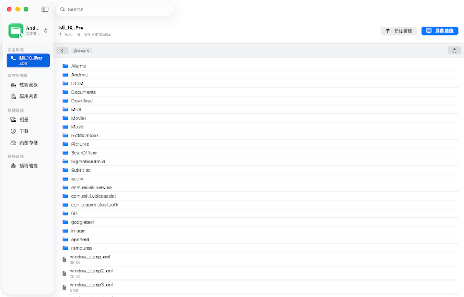
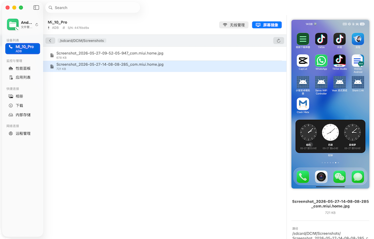
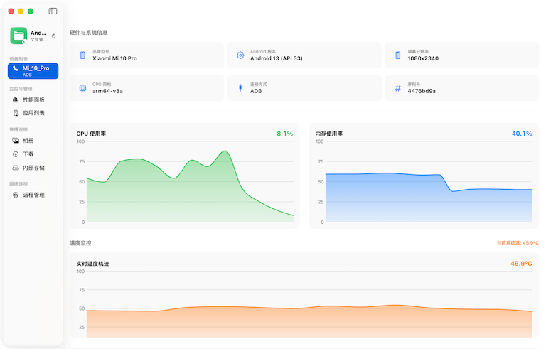

# macOS 安卓手机助理 (Android Mobile Tool - AMT)

一款专为 macOS 设计的全能原生安卓设备管理工具。它不仅仅是一个文件管理器，更是一个集成了性能监控、应用管理、多媒体预览、屏幕镜像和无线远程连接的安卓全能助手。

## 📸 界面预览

| 1. 文件管理 | 2. 应用列表 | 3. 性能监控 |
| :---: | :---: | :---: |
|  |  |  |

## 🚀 核心特性

### 1. 桌面级文件管理
- **双协议支持**: 完美兼容 **ADB** (调试模式) 和 **MTP** (标准文件传输) 协议。
- **原生体验**: 纯 Swift & SwiftUI 构建，支持 macOS 标准的 **Shift 连选**和 **Command 点选**，配以原生的浅蓝色选中高亮。
- **极速传输**: 支持从 Mac 访达直接 **拖拽上传** 到手机，以及右键批量下载到本地。
- **智能导航**: 侧边栏一键直达相册、下载等常用目录，深度适配安卓软链接路径。

### 2. 实时性能仪表盘 (NEW!)
- **性能追踪**: 实时绘制 **CPU 使用率** 和 **内存占用** 折线图。
- **温度监控**: 实时监控系统核心温度，具备直观的颜色安全警示。
- **存储分析**: 动态环形图直观展示内部存储分布。
- **电池概览**: 精准显示电量、充放电状态及电池温度。

### 3. 全能多媒体预览 (无须导出)
- **图片**: 实时渲染高清大图预览。
- **视频**: 内置原生播放器，支持 **窗口比例自适应** 展示（适配横竖屏视频）。
- **音频**: 专属音乐播放 UI，支持 mp3, flac, wav 等主流格式预览。
- **文本**: 支持 json, log, txt, md 等代码与文档预览，具备 512KB 安全读取保护。

### 4. 无线远程管理 (Wireless)
- **Wi-Fi 连接**: 支持手动输入 IP 或通过**局域网自动扫描**连接设备。
- **无线开关**: 一键开启 USB 设备的无线调试模式，或关闭端口保障安全。
- **状态感知**: 侧边栏通过专属图标和标签区分 USB 与 Wi-Fi 设备。

### 5. 高级应用管理 (APK Manager)
- **智能解析**: 集成 AAPT 引擎，自动将包名转化为**真实的中文应用名称**。
- **详情面板**: 双击应用查看高清图标、版本号及版本代码。
- **一键装卸**: 支持 APK 安装（适配 Android 13+ 权限策略）及一键物理卸载。

### 6. 开发者工具
- **屏幕镜像**: 深度集成 `scrcpy`，支持一键开启实时高清投屏（兼容 Wi-Fi 模式）。

---

## 🛠️ 快速开始

### 前置条件

1. **基础工具**:
   ```bash
   brew install android-platform-tools scrcpy
   ```
2. **增强功能** (推荐):
   为了能解析应用名称和图标，请确保已安装 Android SDK (aapt 工具)。

### 构建与运行

1. **克隆仓库**:
   ```bash
   git clone git@github.com:chanf/AMT.git
   cd AMT
   ```
2. **构建应用**:
   ```bash
   chmod +x build_app.sh
   ./build_app.sh
   ```
3. **启动**:
   ```bash
   open AndroidFile.app
   ```

---

## 🏗️ 技术架构

- **UI 框架**: SwiftUI (NavigationSplitView) + AppKit (AVPlayerView)
- **网络核心**: 基于 `Network.framework` 的高性能端口扫描引擎
- **通信核心**: 基于 `Process` 封装的异步 ADB 指令集
- **资源解析**: 集成 `aapt` 元数据解析与 `unzip` 资源提取技术
- **状态管理**: 响应式数据流，支持持久化缓存与并发任务调度
